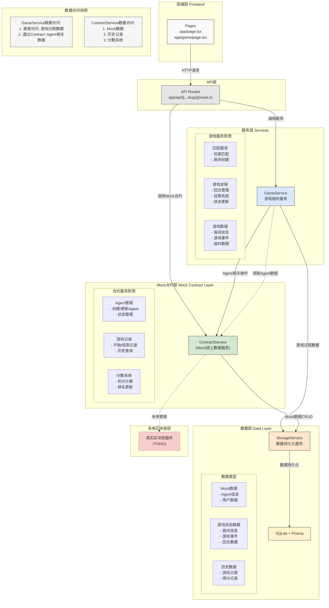

# server
server of deceit

```mermaid
graph TD
    subgraph "前端层 Frontend"
        direction TB
        Pages["Pages<br/>app/page.tsx<br/>app/game/page.tsx"]
        style Pages fill:#f9f9f9,stroke:#333
    end

    subgraph "API层"
        direction TB
        API["API Routes<br/>app/api/[[...slugs]]/route.ts"]
        style API fill:#e6e6e6,stroke:#333
    end

    subgraph "服务层 Services"
        direction TB
        GameService["GameService<br/>游戏组织服务"]
        subgraph "游戏服务职责"
            MatchMaking["匹配服务<br/>- 玩家匹配<br/>- 房间创建"]
            GameProcess["游戏进程<br/>- 回合管理<br/>- 投票系统<br/>- 状态更新"]
            GameData["游戏数据<br/>- 房间状态<br/>- 游戏事件<br/>- 临时数据"]
        end
        style GameService fill:#dae8fc,stroke:#333
    end

    subgraph "Mock合约层 Mock Contract Layer"
        direction TB
        ContractService["ContractService<br/>(Mock链上数据服务)"]
        subgraph "合约服务职责"
            AgentMgmt["Agent管理<br/>- 创建/更新Agent<br/>- 状态管理"]
            GameRecord["游戏记录<br/>- 开始/结束记录<br/>- 历史查询"]
            ScoreSystem["分数系统<br/>- 积分计算<br/>- 排名更新"]
        end
        style ContractService fill:#d5e8d4,stroke:#333
    end

    subgraph "数据层 Data Layer"
        direction TB
        StorageService["StorageService<br/>数据持久化服务"]
        subgraph "数据类型"
            MockData["Mock数据<br/>- Agent信息<br/>- 用户数据"]
            GameStateData["游戏状态数据<br/>- 房间信息<br/>- 游戏事件<br/>- 回合数据"]
            HistoryData["历史数据<br/>- 游戏记录<br/>- 得分记录"]
        end
        DB["SQLite + Prisma"]
        style StorageService fill:#ffe6cc,stroke:#333
        style DB fill:#fff2cc,stroke:#333
    end

    subgraph "未来区块链层"
        direction TB
        BlockchainService["真实区块链服务<br/>(TODO)"]
        style BlockchainService fill:#f8cecc,stroke:#333,stroke-dasharray: 5 5
    end

    %% 数据流向
    Pages -->|"HTTP请求"| API
    API -->|"调用服务"| GameService
    API -->|"调用Mock合约"| ContractService
    
    %% 游戏服务数据流
    GameService -->|"Agent相关操作"| ContractService
    GameService -->|"游戏过程数据"| StorageService
    GameService -.->|"读取Agent数据"| ContractService
    
    %% 合约服务数据流
    ContractService -->|"Mock数据CRUD"| StorageService
    
    %% 存储层数据流
    StorageService -->|"数据持久化"| DB
    
    %% 未来扩展
    ContractService -.->|"未来替换"| BlockchainService

    %% 数据访问说明
    subgraph "数据访问说明"
        direction TB
        GameAccess["GameService数据访问:<br/>1. 直接访问: 游戏过程数据<br/>2. 通过Contract: Agent相关数据"]
        ContractAccess["ContractService数据访问:<br/>1. Mock数据<br/>2. 历史记录<br/>3. 分数系统"]
        style GameAccess fill:#f5f5f5,stroke:#666
        style ContractAccess fill:#f5f5f5,stroke:#666
    end
```

### 初始化数据库
`rm -rf node_modules .next pnpm-lock.yaml && pnpm install`
`npx prisma db push --force-reset && npx prisma generate`
